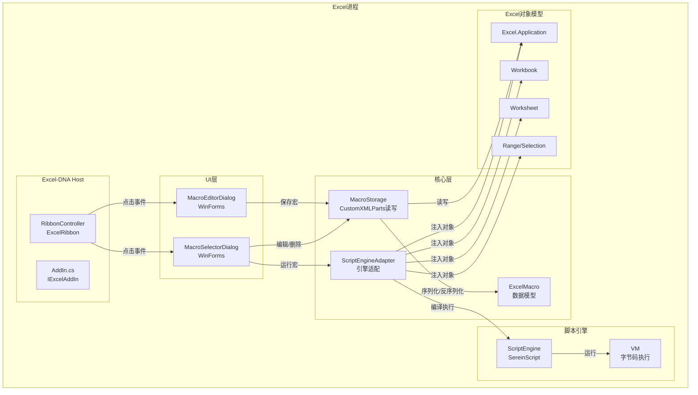

# DESIGN: ExcelScriptLoader v1 — 架构设计

## 1. 架构总览



## 2. 模块设计

### 2.1 AddIn.cs — Excel-DNA 入口

```
职责：插件生命周期管理
接口：IExcelAddIn
```

```csharp
public class AddIn : IExcelAddIn
{
    void AutoOpen();    // Excel启动时：初始化引擎、加载当前工作簿宏
    void AutoClose();   // Excel关闭时：清理资源
}
```

**AutoOpen 流程：**
1. 创建 ScriptEngine 单例
2. 注册 Excel 对象到全局作用域
3. 检测当前活动工作簿是否含 CustomXMLParts 宏
4. 如果有，加载宏到内存列表

**工作簿切换事件：**
- 监听 `Application.WorkbookActivate` → 重新加载新工作簿的宏

### 2.2 ExcelMacro.cs — 数据模型

```
职责：宏的POCO数据载体
```

```csharp
public class ExcelMacro
{
    string Id;            // GUID
    string Name;          // 宏名称（唯一，用于显示）
    string Description;   // 描述
    string ScriptCode;    // C#/SereinScript 脚本代码
    string ShortcutKey;   // 快捷键（P2）
    DateTime CreatedAt;
    DateTime ModifiedAt;
}
```

### 2.3 MacroStorage.cs — CustomXMLParts 存储层

```
职责：宏数据的持久化读写
依赖：Microsoft.Office.Interop.Excel (CustomXMLParts)
```

```csharp
public class MacroStorage
{
    // XML 命名空间
    const string NsUri = "http://sereinscript/excel-macros/v1";
    const string PartName = "/customUI/sereinscript-macros";

    void SaveMacros(Workbook workbook, List<ExcelMacro> macros);
    List<ExcelMacro> LoadMacros(Workbook workbook);
    void DeleteMacro(Workbook workbook, string macroId);
    ExcelMacro? FindByName(Workbook workbook, string name);
}
```

**XML 格式：**
```xml
<macros xmlns="http://sereinscript/excel-macros/v1">
  <macro>
    <id>guid</id>
    <name>HelloWorld</name>
    <description>显示欢迎消息</description>
    <code><![CDATA[app.Selection.Value = "Hello";]]></code>
    <shortcutKey/>
    <createdAt>2026-06-08T12:00:00Z</createdAt>
    <modifiedAt>2026-06-08T12:00:00Z</modifiedAt>
  </macro>
</macros>
```

**实现要点：**
- 使用 `CustomXMLParts.SelectByNamespace()` 查找已有部件
- 不存在则 `Add()` 创建
- 用 `CDATA` 包裹代码避免 XML 转义问题
- 每次保存全量替换（非增量）

### 2.4 RibbonController.cs — Ribbon 菜单

```
职责：自定义Ribbon标签页，绑定按钮事件
基类：ExcelRibbon (ExcelDna.Integration.CustomUI)
```

**Ribbon XML 定义：**
```xml
<customUI xmlns="http://schemas.microsoft.com/office/2009/07/customui">
  <ribbon>
    <tabs>
      <tab id="tabScriptMacro" label="脚本宏">
        <group id="grpMacro" label="宏管理">
          <button id="btnNew"    label="新建宏" imageMso="CreateReport" 
                  onAction="OnNewMacro" size="large"/>
          <button id="btnEdit"   label="编辑宏" imageMso="EditDocument"
                  onAction="OnEditMacro" size="large"/>
          <button id="btnRun"    label="运行宏" imageMso="PlayMacro"
                  onAction="OnRunMacro" size="large"/>
          <button id="btnDelete" label="删除宏" imageMso="Delete"
                  onAction="OnDeleteMacro" size="large"/>
          <button id="btnList"   label="宏列表" imageMso="ViewList"
                  onAction="OnListMacros" size="large"/>
        </group>
      </tab>
    </tabs>
  </ribbon>
</customUI>
```

**回调方法：**
```csharp
public class RibbonController : ExcelRibbon
{
    void OnNewMacro(IRibbonControl control);
    void OnEditMacro(IRibbonControl control);
    void OnRunMacro(IRibbonControl control);
    void OnDeleteMacro(IRibbonControl control);
    void OnListMacros(IRibbonControl control);
    string GetCustomUI();  // 返回 Ribbon XML
}
```

### 2.5 ScriptEngineAdapter.cs — 引擎适配层

```
职责：隔离 ExcelScriptLoader 与 SereinScript 的直接依赖
      管理引擎生命周期、对象注入、代码执行
```

```csharp
public class ScriptEngineAdapter
{
    ScriptEngine _engine;
    Scope? _excelScope;

    void Initialize(Application excelApp);
    // 1. 创建 ScriptEngine
    // 2. 构建 Excel Scope: app, workbook, sheet, cell, selection
    // 3. 注册原生函数：print(), msgbox() 等

    Task<ScriptResult> ExecuteAsync(string scriptCode, string macroName);
    // 1. 刷新 Scope 中的 Excel 对象引用（工作簿可能切换）
    // 2. 调用 engine.CreateTaskFromSource(scriptCode, macroName, scope)
    // 3. 等待 RunAsync()
    // 4. 包装返回值

    void RefreshExcelContext();
    // 每次执行前刷新 workbook/sheet/cell/selection 引用
}

public class ScriptResult
{
    bool Success;
    string? ReturnValue;
    string? ErrorMessage;
    TimeSpan ExecutionTime;
}
```

**SereinScript 需修改：**

在 `ScriptEngine.cs` 中新增：
```csharp
/// <summary>
/// 从源代码字符串创建执行任务（用于内存中的脚本代码）
/// </summary>
public ScriptTask CreateTaskFromSource(string source, string sourceName, Scope? scope = null)
{
    GlobalScope.Clear();
    BuiltinCache.RegisterAll(GlobalScope);

    // 注册源代码
    SourceManager.AddSource(sourceName, source);

    // 词法分析
    var lexer = new Lexer.Lexer(source, sourceName);
    var tokens = lexer.ScanTokens();

    // 语法分析
    var parser = new Parser.Parser(tokens, sourceName);
    var expr = parser.Parse();

    if (parser.Diagnostics.Count > 0)
    {
        var errors = string.Join("\n", parser.Diagnostics);
        throw new Exception($"脚本解析错误:\n{errors}");
    }

    scope ??= new Scope(GlobalScope);
    RegisterExternalScopeToGlobalSlots(scope);
    return CreateCompiledTask(expr);
}
```

### 2.6 Dialogs — WinForms UI

#### MacroEditorDialog
```
控件：
- TextBox:     宏名称（必填，校验重名）
- TextBox:     描述（可选）
- TextBox:     代码编辑器（多行，等宽字体）
- Button:      保存
- Button:      保存并运行
- Button:      取消
```

#### MacroSelectorDialog
```
控件：
- ListView:    宏列表（名称 | 描述 | 修改时间）
- Button:      运行
- Button:      编辑
- Button:      删除
- Button:      取消
```

## 3. 数据流

### 3.1 新建宏流程
```
Ribbon[新建宏] → MacroEditorDialog(空表单)
  → 用户输入名称+代码 → [保存]
  → MacroStorage.SaveMacros(workbook, macros)
  → CustomXMLParts.Add() 或 Replace()
  → 提示"保存成功"
```

### 3.2 运行宏流程
```
Ribbon[运行宏] → MacroSelectorDialog(宏列表)
  → 用户选择宏 → [运行]
  → ScriptEngineAdapter.RefreshExcelContext()
  → ScriptEngineAdapter.ExecuteAsync(code, name)
  → ScriptEngine.CreateTaskFromSource()
  → Lexer → Parser → Compiler → VM.ExecuteAsync()
  → 脚本内操作 Excel 对象（app.Selection.Value = "Hello"）
  → 返回 ScriptResult { Success, ReturnValue, ErrorMessage }
  → 显示结果或错误
```

### 3.3 打开含宏工作簿
```
Excel启动 → AutoOpen()
  → MacroStorage.LoadMacros(activeWorkbook)
  → CustomXMLParts.SelectByNamespace(NsUri)
  → 解析XML → List<ExcelMacro>
  → 保存到内存列表
  → 宏就绪，可通过Ribbon运行
```

## 4. 异常处理策略

| 异常类型 | 处理方式 |
|----------|----------|
| 脚本语法错误（Parser） | 捕获异常，在对话框中显示错误详情 |
| 脚本运行时异常（VM） | 捕获 RuntimeException，显示行号和堆栈 |
| CustomXMLParts 损坏 | 提示用户，跳过损坏的宏 |
| Excel 对象访问异常 | 捕获 COMException，显示友好提示 |
| 引擎初始化失败 | AutoOpen 中记录日志，Ribbon 按钮置灰 |

## 5. 接口契约

### 5.1 AddIn 公共接口
```csharp
public class AddIn : IExcelAddIn
{
    // 由 Excel-DNA 框架调用
    void IExcelAddIn.AutoOpen();
    void IExcelAddIn.AutoClose();

    // 供 Ribbon 回调使用
    static List<ExcelMacro> GetCurrentMacros();
    static void RefreshMacros();
    static ScriptResult RunMacro(ExcelMacro macro);
}
```

### 5.2 MacroStorage 接口
```csharp
public class MacroStorage
{
    static List<ExcelMacro> LoadMacros(Workbook workbook);
    static void SaveMacros(Workbook workbook, List<ExcelMacro> macros);
    static void DeleteMacro(Workbook workbook, string macroId);
    static bool NameExists(Workbook workbook, string name, string? excludeId);
}
```

### 5.3 ScriptEngineAdapter 接口
```csharp
public class ScriptEngineAdapter
{
    void Initialize(Application excelApp);
    Task<ScriptResult> ExecuteAsync(string code, string macroName);
    void RefreshExcelContext();
    void Dispose();
}
```
