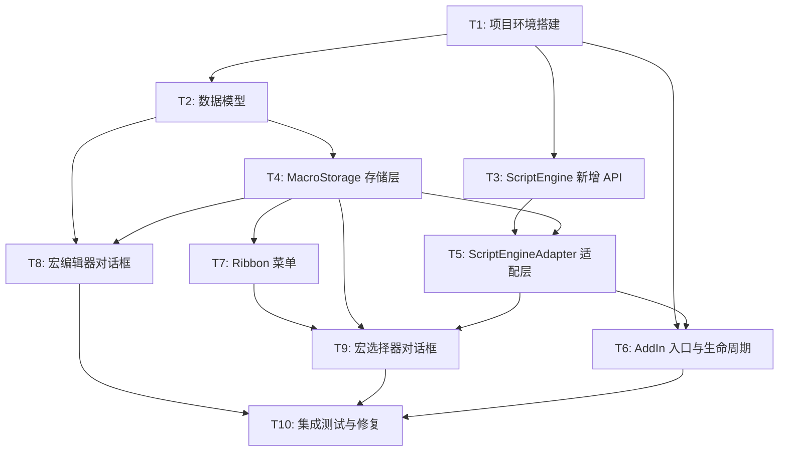

# TASK: ExcelScriptLoader v1 — 任务拆分

## 依赖图

## 任务清单

### T1: 项目环境搭建
| 项目 | 内容 |
|------|------|
| **输入** | 当前空壳 .csproj、SereinScript 项目 |
| **输出** | 可编译的 Excel-DNA 插件项目 + 统一 Solution |
| **约束** | TargetFramework=net10.0-windows, UseWindowsForms=true, x64 |
| **验收** | `dotnet build` 成功，生成 .xll 文件 |

**子任务：**
1. 修改 `ExcelScriptLoader.csproj`：OutputType→Library，添加 ExcelDna 包，配置 WindowsForms
2. 安装 NuGet 包：`ExcelDna.AddIn`、`ExcelDna.Registration`、`Microsoft.Office.Interop.Excel`
3. 创建 `.xll.config` 运行时配置
4. 创建 `ExcelScriptLoader-AddIn.dna` 清单文件
5. 创建统一 Solution 包含 ScriptLang 项目引用
6. 验证编译 → 生成 XLL

---

### T2: 数据模型
| 项目 | 内容 |
|------|------|
| **输入** | 需求文档中的宏数据结构定义 |
| **输出** | `ExcelMacro.cs` 模型类 |
| **约束** | POCO 风格，属性与 XML 存储对应 |
| **验收** | 可正确序列化/反序列化 |

**子任务：**
1. 创建 `ExcelMacro.cs` 类（Id, Name, Description, ScriptCode, ShortcutKey, CreatedAt, ModifiedAt）
2. 添加 XML 序列化/反序列化方法
3. 添加验证逻辑（名称非空、无非法字符）

---

### T3: ScriptEngine 新增 CreateTaskFromSource API
| 项目 | 内容 |
|------|------|
| **输入** | 现有 `ScriptEngine.cs` API 分析 |
| **输出** | `ScriptEngine.CreateTaskFromSource()` 方法 |
| **约束** | 复用现有编译管道，不破坏已有 API |
| **验收** | 字符串代码可编译执行，返回正确结果 |

**子任务：**
1. 在 `ScriptEngine.cs` 中新增 `CreateTaskFromSource(string source, string sourceName, Scope? scope)` 
2. 复用 `SourceManager.AddSource()` + 现有 Lexer/Parser/Compiler 管线
3. 编写 Demo 测试验证

---

### T4: MacroStorage 存储层
| 项目 | 内容 |
|------|------|
| **输入** | ExcelMacro 模型、CustomXMLParts API |
| **输出** | `MacroStorage.cs` 完整 CRUD |
| **约束** | 使用 `Microsoft.Office.Interop.Excel` CustomXMLParts |
| **验收** | 保存→读取→删除单元测试通过 |

**子任务：**
1. 实现 `LoadMacros(Workbook)` — 查询并解析 XML
2. 实现 `SaveMacros(Workbook, List<ExcelMacro>)` — 全量序列化写入
3. 实现 `DeleteMacro(Workbook, macroId)` — 定位并删除单个宏
4. 实现 `NameExists(Workbook, name, excludeId?)` — 重名校验
5. 处理 CustomXMLParts 不存在/损坏的边界情况

---

### T5: ScriptEngineAdapter 适配层
| 项目 | 内容 |
|------|------|
| **输入** | T3 新增的 API、T4 存储层 |
| **输出** | `ScriptEngineAdapter.cs` 完整适配器 |
| **约束** | 隔离 SereinScript 依赖，管理 Excel 对象注入 |
| **验收** | 可执行脚本代码，脚本中可访问 Excel 对象 |

**子任务：**
1. 实现 `Initialize(Application)` — 创建引擎，构建 Excel Scope
2. 实现 `RefreshExcelContext()` — 刷新 app/workbook/sheet/cell/selection
3. 实现 `ExecuteAsync(code, macroName)` — 编译+执行+异常处理
4. 创建 `ScriptResult` 返回值模型
5. 添加 `print()` / `msgbox()` 等实用内置函数

---

### T6: AddIn 入口与生命周期
| 项目 | 内容 |
|------|------|
| **输入** | T5 适配层、T4 存储层 |
| **输出** | `AddIn.cs` IExcelAddIn 实现 |
| **约束** | Excel-DNA 规范 |
| **验收** | 插件启动/关闭正常，工作簿切换时刷新宏列表 |

**子任务：**
1. 实现 `AutoOpen()` — 初始化适配器、加载当前工作簿宏
2. 实现 `AutoClose()` — 清理引擎资源
3. 监听 `WorkbookActivate` 事件 → 切换工作簿时重载宏
4. 监听 `WorkbookBeforeClose` 事件 → 清理对应宏缓存
5. 提供静态属性 `CurrentMacros` / `Adapter` 供 Ribbon 使用

---

### T7: Ribbon 菜单
| 项目 | 内容 |
|------|------|
| **输入** | T6 AddIn 入口 |
| **输出** | `RibbonController.cs` + Ribbon XML |
| **约束** | 标签页名称"脚本宏"，5 个按钮 |
| **验收** | Excel 中显示自定义标签页，按钮可点击 |

**子任务：**
1. 创建 `RibbonController : ExcelRibbon` 类
2. 编写 Ribbon XML 定义
3. 实现 5 个按钮回调（OnNewMacro, OnEditMacro, OnRunMacro, OnDeleteMacro, OnListMacros）
4. 按钮事件绑定到对话框/存储操作

---

### T8: 宏编辑器对话框
| 项目 | 内容 |
|------|------|
| **输入** | T4 存储层、T2 数据模型 |
| **输出** | `MacroEditorDialog.cs` WinForms 窗体 |
| **约束** | 模态对话框，名称非空校验，等宽字体代码编辑 |
| **验收** | 可新建/编辑宏并保存到工作簿 |

**子任务：**
1. 设计 WinForms 窗体布局
2. 实现"保存"逻辑 → 调用 MacroStorage.SaveMacros
3. 实现重名校验
4. 实现"保存并运行"逻辑
5. 代码编辑器使用等宽字体（Consolas）

---

### T9: 宏选择器对话框
| 项目 | 内容 |
|------|------|
| **输入** | T4 存储层、T5 适配层 |
| **输出** | `MacroSelectorDialog.cs` WinForms 窗体 |
| **约束** | ListView 显示宏列表，支持运行/编辑/删除 |
| **验收** | 可选择宏、运行、编辑、删除 |

**子任务：**
1. 设计 WinForms 窗体布局（ListView + 4 按钮）
2. 实现"运行" → ScriptEngineAdapter.ExecuteAsync
3. 实现"编辑" → 打开 MacroEditorDialog
4. 实现"删除" → MacroStorage.DeleteMacro + 确认对话框
5. 执行结果展示（成功提示 / 错误对话框）

---

### T10: 集成测试与修复
| 项目 | 内容 |
|------|------|
| **输入** | T1-T9 全部完成 |
| **输出** | 可发布的 XLL 插件 + 测试报告 |
| **约束** | 真实 Excel 环境测试 |
| **验收** | 所有 P0/P1 功能正常 |

**子任务：**
1. 新建宏 → 保存 → 关闭工作簿 → 重新打开 → 宏仍存在
2. 编辑宏 → 保存 → 修改生效
3. 运行宏 → Excel 对象操作生效
4. 删除宏 → 从列表消失
5. 多宏共存测试
6. 脚本错误处理测试（语法错误、运行时异常）
7. 工作簿切换测试
8. 生成 ACCEPTANCE 文档
